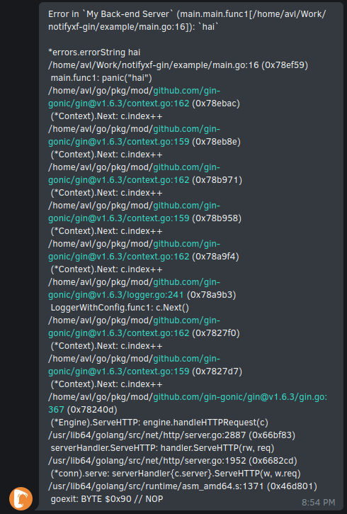

# gin notifyxf

## What

This is a package to make it easier to use [notifyxf.com](https://notifyxf.com) in gin golang applications.

## Sample

Either navigate to the [example](example/main.go) to check how to use or read along.

## Gin usage

To use this:

```go
router := gin.Default()

tkn := "...notifyxf token..."
name := "My Back-end Server"

router.Use(notifyxf.Recover(tkn, name))

router.GET("/", func(c *gin.Context) {
    panic("error")
})

router.Run()
```

## Normal usage

If you want to control what notifications you'll get, please use the `notifyxf.Notify`-func.

```go
tkn := "...notifyxf token..."

err := notifyxf.Recover(tkn, "some message")
panic(err)
```

## Example output - gin


